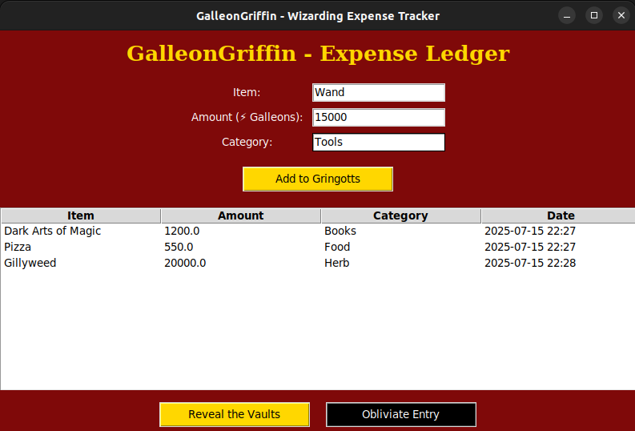

# 🪙 GalleonGriffin - Wizarding Expense Tracker

Welcome to **GalleonGriffin**, your magical companion for tracking daily expenses with a Gryffindor twist!  
Inspired by the vaults of **Gringotts** and designed in the spirit of **Hogwarts**, this tracker helps you manage your galleons, knuts, and sickles – muggle-style.

---

## ⚡ Features

- 📝 Add items, amounts, and categories to your magical expense ledger
- 📊 Visualize category-wise expense distribution via a pie chart (Reveal the Vaults)
- 🧹 Delete entries with a charm (`Obliviate Entry`)
- 💾 Auto-saving to `vault_data.json` for persistence between sessions
- 🎨 Styled in Gryffindor colors with wizarding language

---

## 🧑‍💻 Getting Started

### Requirements

- Python 3.10+
- `matplotlib` library (auto-installed via `requirements.txt`)

### Installation

```bash
git clone https://github.com/yourusername/GalleonGriffin.git
cd GalleonGriffin
pip install -r requirements.txt
python GalleonGriffin.py
```

### Screenshot

> 